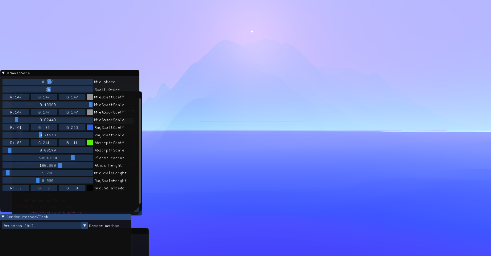
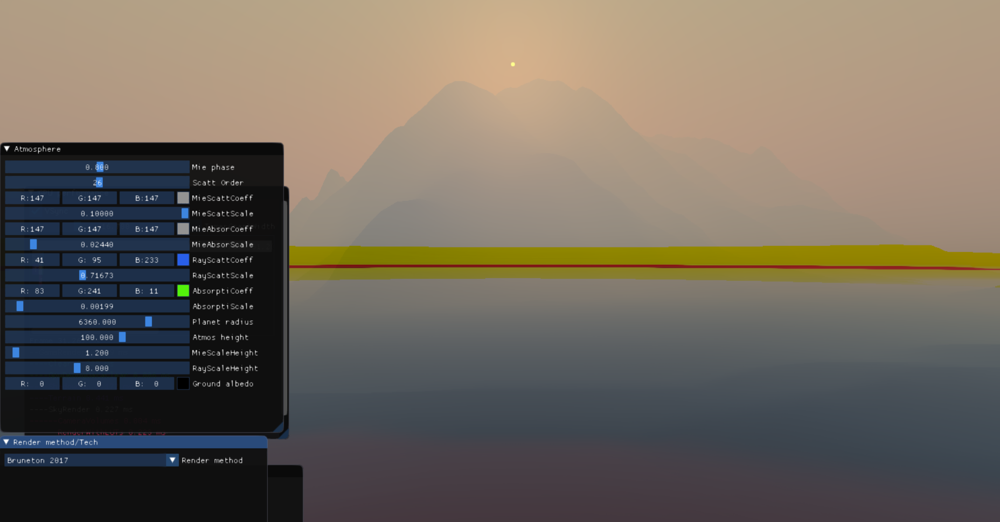
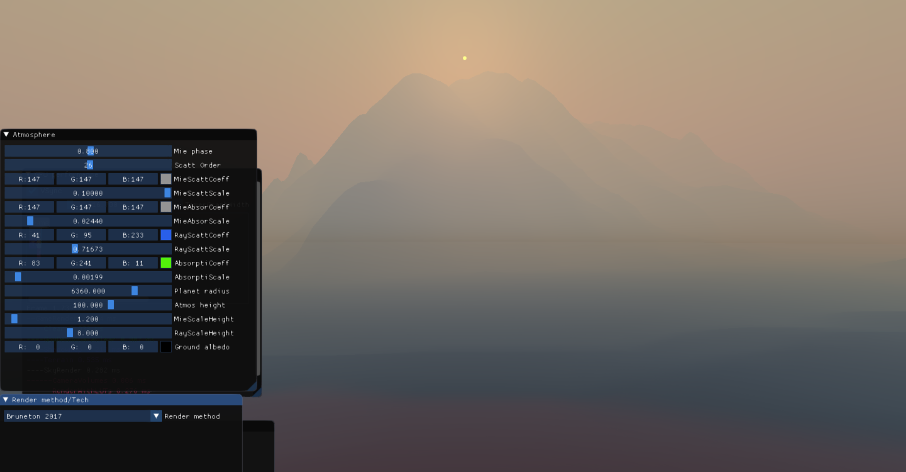
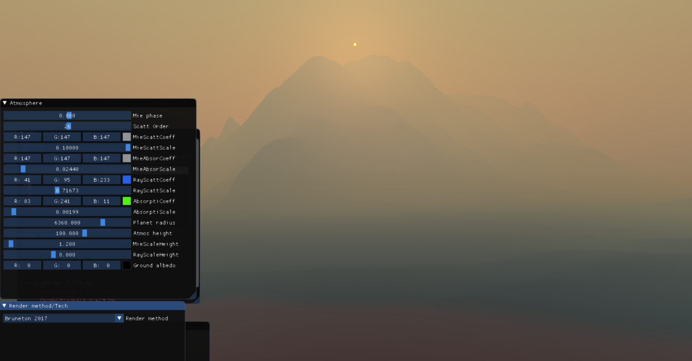
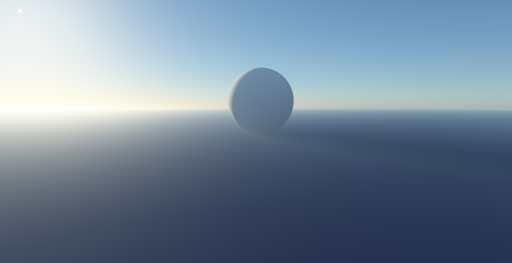

# [Precomputed Atmospheric Scattering](https://github.com/ebruneton/precomputed_atmospheric_scattering) for Thick Atmospheres

Original

Improve the scattering integration ([commit link](https://github.com/c52e/UnrealEngineSkyAtmosphere/commit/319d4c475b88b5635ccde315b0f1bd5054fa41b5))

Store optical length instead of transmittance to fix artifacts near the horizon ([commit link](https://github.com/c52e/UnrealEngineSkyAtmosphere/commit/e041eaa02086f34059015723376cee2771f6ba86))

Increase sample count ([commit link](https://github.com/c52e/UnrealEngineSkyAtmosphere/commit/a9971e90091e12098c03e997291852e864c0ff72))

[Multiple scattering LUT](https://sebh.github.io/publications/egsr2020.pdf) can be used to reduce the cost of precomputation.

Single scattering

9 order multiple scattering

Use multiple scattering LUT

With multiple scattering LUT, physically based overcast sky can be simulated by adding an additional dense mie scattering layer at altitudes of clouds.

With additional dense mie scattering layer

Without additional dense mie scattering layer

